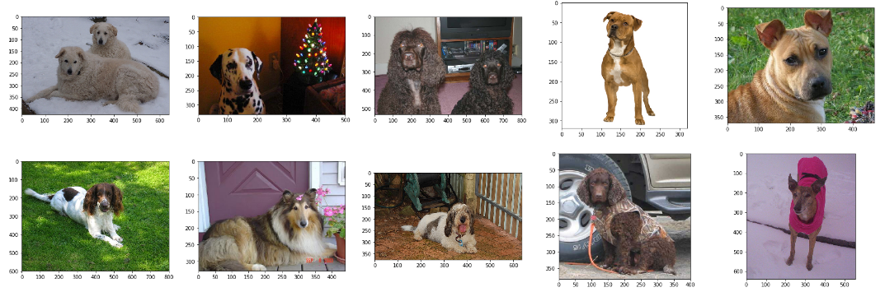
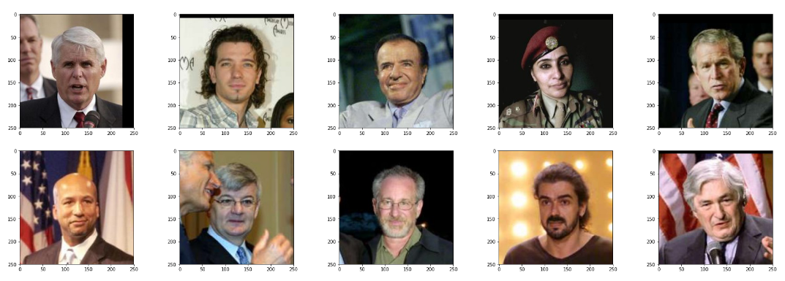
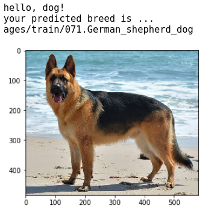

## Project Overview
The main objective of the project is to use Deep Learning concepts to build an image classifier that classifies an input image. This input image can be either of a Human or a dog, the classifier will be able to correctly classify that it is either a Human or a dog and also It will classify dog’s breed if the image is of a dog. For the fun part, the classifier will also classify the image of a human to its closest lookalike dog-breed. The projects use high-level deep learning concepts such as CNN and transfer learning.

## Data Understanding and Preprocessing
The Dog data contains 133 total dog categories and there are 8351 total dog images. You can download the dog data set from the link here.

 


The Human Image dataset contains 13233 Human images.



We can see that human faces are of the same size but the dog images are of different shapes. It will be beneficial to preprocess the dog images before any type of training and reshape them to the same sizes. Thus in the project, all the dog images are resized to the shape (224,224) using the `Keras` package.
## Human and Dog Classifier
There were two models that were used for Human and dog classifications, They were :
* Using the OpenCV’s implementation of Haar feature-based cascade classifiers to detect human faces in images `OpenCV` provides many pre-trained face detectors, stored as XML files on GitHub before using any of the face detectors, it is standard procedure to convert the images to grayscale. The model was doing well in classifying the human faces as human but also miss classifying dog images as human images thus different strategy was required.
* Now the pre-trained `ResNet-50 model` is used to detect dogs in images. ResNet-50 model was downloaded, along with weights that have been trained on ImageNet, a very large, very popular dataset used for image classification and other vision tasks. ImageNet contains over 10 million URLs, each linking to an image containing an object from one of 1000 categories. Given an image, this pre-trained `ResNet-50` model returns a prediction (derived from the available categories in ImageNet) for the object that is contained in the image.
## CNN to Classify Dog Breeds (from Scratch)
According to Wikipedia, A convolutional neural network consists of an input and an output layer, as well as multiple hidden layers. The hidden layers of a `CNN` typically consist of a series of convolutional layers that convolve with multiplication or other dot product. The activation function is commonly a `RELU layer` and is subsequently followed by additional convolutions such as pooling layers, fully connected layers, and normalization layers referred to as hidden layers because their inputs and outputs are masked by the activation function and final convolution.

_A typical CNN Architecture._


I used `8 layered` CNN architecture including the Fully Connected Layer. `Rmsprop` as the optimizer and `categorical cross-entropy` as the loss function.


_Architecture I used for my model_

After training for 10 epochs my model achieved Training accuracy of `~3.6%` and validation accuracy of `~3.2%`.
Classification Using Transfer learning
## Transfer Learning
Transfer Learning is a Machine Learning Paradigm that mainly focuses on storing knowledge gained when solving one problem and then applying it to different problems that are related. You can know more about Transfer Learning here.
In this project, transfer learning is used and it has been tried with two different models.
### VGG-16 Model
The model uses the pre-trained `VGG-16` model as a fixed feature extractor, where the last convolutional output of VGG-16 is fed as input to our model. We only add a global average pooling layer and a fully connected layer, where the latter contains one node for each dog category and is equipped with a softmax.
This model had a validation accuracy of `~44%` and training accuracy of `~55%` the model was clearly underfitting.
### Resnet-50 Model
We have learned about the `Resnet-50` model above to know more you can read here.
Using the flattened output of `Resnet-50` model and the fully connected layer of 133 node having activation function `“softmax”` model achieved validation accuracy of `~82%` and training accuracy of `~99%` when trained `20` epochs.

## Result 
Here is one of the result of the Model.




***

### Instructions

1. Clone the repository and navigate to the downloaded folder.
```	
git clone https://github.com/Hnmani/dog-breed-project.git
cd dog-breed-project
```

2. Download the [dog dataset](https://s3-us-west-1.amazonaws.com/udacity-aind/dog-project/dogImages.zip).  Unzip the folder and place it in the repo, at location `path/to/dog-project/dogImages`. 

3. Download the [human dataset](https://s3-us-west-1.amazonaws.com/udacity-aind/dog-project/lfw.zip).  Unzip the folder and place it in the repo, at location `path/to/dog-project/lfw`.  If you are using a Windows machine, you are encouraged to use [7zip](http://www.7-zip.org/) to extract the folder. 

4. Download the [VGG-16 bottleneck features](https://s3-us-west-1.amazonaws.com/udacity-aind/dog-project/DogVGG16Data.npz) for the dog dataset.  Place it in the repo, at location `path/to/dog-project/bottleneck_features`.

5. (Optional) __If you plan to install TensorFlow with GPU support on your local machine__, follow [the guide](https://www.tensorflow.org/install/) to install the necessary NVIDIA software on your system.  If you are using an EC2 GPU instance, you can skip this step.

6. (Optional) **If you are running the project on your local machine (and not using AWS)**, create (and activate) a new environment.

	- __Linux__ (to install with __GPU support__, change `requirements/dog-linux.yml` to `requirements/dog-linux-gpu.yml`): 
	```
	conda env create -f requirements/dog-linux.yml
	source activate dog-project
	```  
	- __Mac__ (to install with __GPU support__, change `requirements/dog-mac.yml` to `requirements/dog-mac-gpu.yml`): 
	```
	conda env create -f requirements/dog-mac.yml
	source activate dog-project
	```  
	**NOTE:** Some Mac users may need to install a different version of OpenCV
	```
	conda install --channel https://conda.anaconda.org/menpo opencv3
	```
	- __Windows__ (to install with __GPU support__, change `requirements/dog-windows.yml` to `requirements/dog-windows-gpu.yml`):  
	```
	conda env create -f requirements/dog-windows.yml
	activate dog-project
	```

7. (Optional) **If you are running the project on your local machine (and not using AWS)** and Step 6 throws errors, try this __alternative__ step to create your environment.

	- __Linux__ or __Mac__ (to install with __GPU support__, change `requirements/requirements.txt` to `requirements/requirements-gpu.txt`): 
	```
	conda create --name dog-project python=3.5
	source activate dog-project
	pip install -r requirements/requirements.txt
	```
	**NOTE:** Some Mac users may need to install a different version of OpenCV
	```
	conda install --channel https://conda.anaconda.org/menpo opencv3
	```
	- __Windows__ (to install with __GPU support__, change `requirements/requirements.txt` to `requirements/requirements-gpu.txt`):  
	```
	conda create --name dog-project python=3.5
	activate dog-project
	pip install -r requirements/requirements.txt
	```
	
8. (Optional) **If you are using AWS**, install Tensorflow.
```
sudo python3 -m pip install -r requirements/requirements-gpu.txt
```
	
9. Switch [Keras backend](https://keras.io/backend/) to TensorFlow.
	- __Linux__ or __Mac__: 
		```
		KERAS_BACKEND=tensorflow python -c "from keras import backend"
		```
	- __Windows__: 
		```
		set KERAS_BACKEND=tensorflow
		python -c "from keras import backend"
		```

10. (Optional) **If you are running the project on your local machine (and not using AWS)**, create an [IPython kernel](http://ipython.readthedocs.io/en/stable/install/kernel_install.html) for the `dog-project` environment. 
```
python -m ipykernel install --user --name dog-project --display-name "dog-project"
```

11. Open the notebook.
```
jupyter notebook dog_app.ipynb
```

12. (Optional) **If you are running the project on your local machine (and not using AWS)**, before running code, change the kernel to match the dog-project environment by using the drop-down menu (**Kernel > Change kernel > dog-project**). Then, follow the instructions in the notebook.

__NOTE:__ While some code has already been implemented to get you started, you will need to implement additional functionality to successfully answer all of the questions included in the notebook. __Unless requested, do not modify code that has already been included.__
